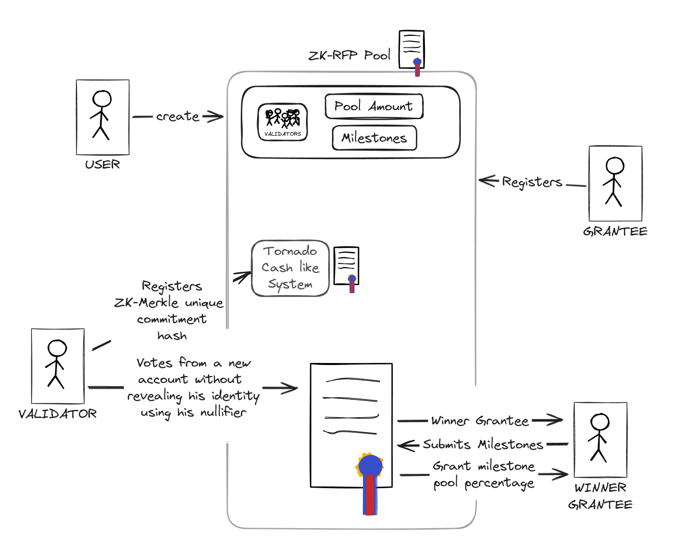

# ZK-RFP a project built on Encode ZK-Bootcamp

## Powered by Allo RFP Strategy and ZKVote-Tree

Anonymous Allocation voting for RFPs using the Allo protocol on Ethereum based blockchain using zero knowledge proofs from circom

## Usage

- Clone the repository by `git clone https://github.com/TheBojda/zktree-vote.git`
- Install wget (by `apt-get install wget` on Ubuntu/Debian)
- Install the project dependencies and prepare by `npm install` in the project directory
- Start a Hardhat node by `npx hardhat node` in the project directory
- In another terminal deploy the smartcontract by `npm run deploy`
- Start the app by `npm start`

The app uses MetaMask to connect the blockchain, so the MetaMask extension have to be installed, and connected to the Hardhat local node. The smart contract owner is the first Hardhat account, and the second account is set as a validator by the deployment script.

## Architecture Diagram

